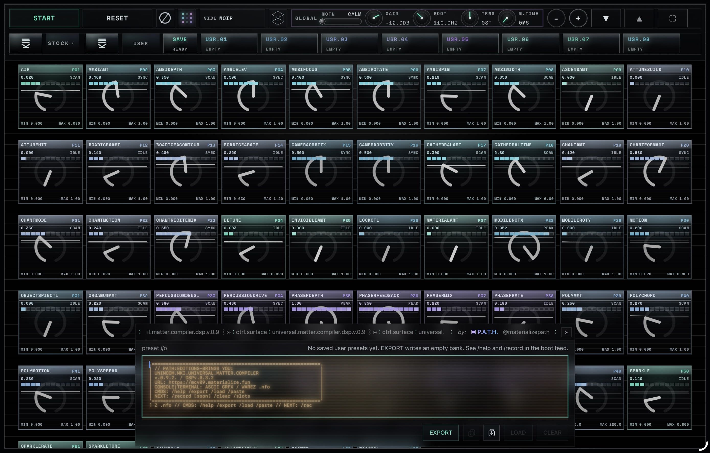

# unimcom

**UNIMCOM.MKI.UNIVERSAL.MATTER.COMPILER** — a Faust DSP control-surface instrument

> `universal.matter.compiler.dsp.v.0.9.2` · `DSPv.0.3.2` · `PATH:EDITIONS`

Live site: **[mcv09.materialize.fun](https://mcv09.materialize.fun)**



---

## What it is

A buildless static PWA that turns a Faust/WASM ambient DSP into a dense, tactile, retro-HUD control surface for shaping matter-like drone states through presets, motion, haptics, and shareable user-preset transfer codes.

It is not only a synth — it is an authored interface and sonic world. Part control surface, part ritual console, part audio object. Dense but alive. Technical but mystical. Precise but strange.

The user should feel like they are tuning a machine that has its own weather.

## Features

- **57-parameter Faust control grid** generated from the DSP UI descriptor — every knob wired directly to DSP parameters
- **Preset system** — stock presets with quick-morph buttons, morph cards/knobs, and 8 local user slots persisted in `localStorage`
- **Footer preset I/O console** — transfer-code export/load/clear/copy/paste with a CRT/terminal/`.nfo` aesthetic
- **VIBE/theme switching** with persistence across sessions
- **Motion mode** — device sensor-driven parameter modulation with a 3D cube glyph and permission flow
- **Experimental iOS haptics** with hidden-switch fallback plumbing
- **Service worker caching** — offline-capable with cache versioning for deployed builds
- **Global controls** — gain, root, transpose, morph time, motion sensitivity
- **Zoom, scroll, fullscreen** controls for the grid
- **Audio unlock** — explicit user gesture required; startup preset applied once after activation

## Running locally

No build system. No package manager. No bundler. Serve the directory with any static HTTP server:

```bash
python3 -m http.server 8000
```

Then open `http://localhost:8000`.

> ⚠️ Use a static server, not `file://`. Local preview intentionally unregisters the service worker — localhost and deployed caching behavior are intentionally different.

## Project structure

```
index.html              Page shell, inline CSS, footer/preset console markup
index.js                Main runtime, HUD, presets, persistence, audio activation
create-node.js          Faust node creation, UI bridge, theme/zoom, iOS haptics
service-worker.js       Offline cache, cache versioning, COOP/COEP headers
dsp-module.wasm         Prebuilt Faust DSP module
dsp-meta.json           Faust DSP metadata / UI descriptor
faust-ui/               Local Faust UI dependency (CSS + JS)
faustwasm/              Local Faust runtime JS
vendor/                 Vendored libraries (Three.js)
docs/                   System architecture and UI control reference
```

## Design language

Monochrome. Retro. HUD-like. CRT console footer. Warez `.nfo` texture. Bold, dense, and intentionally authored.

This interface resists being flattened into a generic synth panel or SaaS dashboard.

## What must stay true

- Preserve the authored HUD / CRT / console visual language
- Preserve explicit audio unlock — no auto-start on page load
- Preserve mobile/touch friendliness
- Preserve preset morphing and user-preset portability
- Do not genericize the interface

## Fragile systems

Treat these as sensitive and regression-test after any edits:

- Audio unlock and `AudioContext` activation timing
- Pointer/touch gesture handling for knobs and preset morph controls
- Preset morph logic and baseline/target state handling
- Footer console sizing, typography, and boot-overlay behavior
- Theme switching and persistence
- Motion mode and sensor permission flows
- Service-worker cache/version behavior
- iOS haptics (never simplify without real device testing)

## Cache-bust touchpoints

When shipping frontend asset changes, update all version strings together:

- `index.html` — script/style cache-bust query strings
- `index.js` — `CREATE_NODE_MODULE_SPEC`
- `create-node.js` — `HUD_ASSET_VERSION`
- `service-worker.js` — `CACHE_NAME`, `INDEX_ASSET_VERSION`, `CREATE_NODE_MODULE_VERSION`

## Credits

**P.A.T.H.** ([@materializepath](https://github.com/materializepath))

Built with [Faust](https://faust.grame.fr/) and raw browser APIs.

---

*A compact, strange, expressive web instrument. A black-box matter compiler you tune with your hands.*
