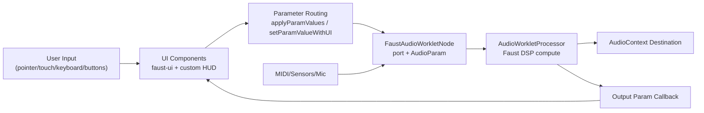
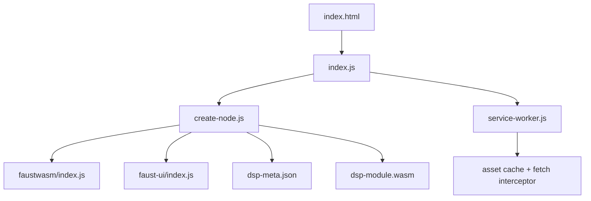

# System Architecture: Control Surface UI

## 1. High-Level Overview

### Overall system purpose
This project is a browser-based Faust DSP instrument with a custom control-surface UI. It compiles/loads a prebuilt Faust WASM module, renders a dense knob grid, applies preset/morph workflows, and drives real-time audio output via Web Audio.

Primary bootstrap path:
- `index.html` loads `index.js` and provides the root container `#div-faust-ui`.
- `index.js` creates/suspends an `AudioContext`, initializes the Faust node/UI, and mounts runtime HUD controls (`index.js:27-30`, `index.js:1862-1883`, `index.js:1148-1860`).
- `create-node.js` creates the Faust DSP node and wraps Faust UI into a custom grid/HUD bridge (`create-node.js:22-80`, `create-node.js:1007-1172`).

### Major subsystems

#### Audio / DSP
- Precompiled Faust assets: `dsp-module.wasm`, `dsp-meta.json`.
- Node creation pipeline in `create-node.js:createFaustNode`.
- Runtime audio backend from local `faustwasm/index.js` (`FaustMonoDspGenerator`, AudioWorklet processor/node classes).

#### UI / Control Surface
- Dynamic knob grid from Faust UI descriptor (`create-node.js:582-602`, `create-node.js:1073-1111`).
- Custom HUD overlay per knob (signal bars, sparkline, labels, haptic feedback) (`create-node.js:630-999`).
- Top control strip + preset buttons + preset morph knobs (`index.js:1148-1860`).

#### Rendering
- DOM + CSS layout from `index.html`.
- 2D canvas rendering for Faust knobs (`faust-ui/index.js:1362-1403`) and custom sparklines (`create-node.js:492-521`).
- Event-driven repaint scheduling via `requestAnimationFrame` in both `faust-ui` and custom HUD layers (`faust-ui/index.js:338-379`, `create-node.js:980-986`).

#### Input
- Pointer/touch/mouse/keyboard on controls and knobs (`faust-ui/index.js:429-530`, `index.js:1460-1546`).
- Web MIDI input routed into Faust MIDI events (`index.js:1897-1913`).
- Device motion/orientation sensors optionally routed to Faust sensor handlers (`index.js:1951-1958`, `faustwasm/index.js:4005-4027`).
- Optional microphone input if DSP has inputs (`index.js:1973-1975`, `create-node.js:91-111`).

#### State
- In-memory module-level mutable state in `index.js` (no external state manager) (`index.js:33-66`, `index.js:1934-1938`).
- Preset catalog in immutable objects (`index.js:88-596`).

#### Networking / PWA
- Static asset fetch for DSP/UI modules (`create-node.js:31-35`, `create-node.js:285-301`).
- Service worker caching and fetch strategy (`service-worker.js:72-196`).
- No sockets/WebRTC/custom backend.

### Data flow between subsystems

Core write path (knob gesture):
- Knob sets value in `faust-ui` component (`faust-ui/index.js:1404-1407`, `faust-ui/index.js:555-566`).
- `faustUI.paramChangeByUI` is overridden to call bridge setter (`create-node.js:1103`, `create-node.js:1056-1060`).
- Bridge calls `faustNode.setParamValue` and mirrors to UI (`create-node.js:1056-1060`).
- DSP output handler pushes back to UI (`create-node.js:1104`).

---

## 2. Audio Architecture

### How Faust DSP is compiled and loaded
This app uses **precompiled Faust WASM artifacts**, not runtime source compilation.

`create-node.js:createFaustNode`:
- Loads metadata JSON via `fetch("./dsp-meta.json")` (`create-node.js:31`).
- Compiles WASM via `WebAssembly.compileStreaming(fetch("./dsp-module.wasm"))` (`create-node.js:34`).
- Imports Faust runtime generators from local `faustwasm` (`create-node.js:27`).

Node creation mode:
- Mono when `voices <= 0` (current default) (`create-node.js:44`, `create-node.js:66-75`).
- Poly path exists (optional mixer/effect modules) when `voices > 0` (`create-node.js:44-65`).

### Where/how DSP instance is created
Instance creation chain for current mono AudioWorklet path:
1. `index.js` calls `createFaustNode(audioContext, "osc", FAUST_DSP_VOICES)` (`index.js:1870`).
2. `create-node.js` uses `FaustMonoDspGenerator.createNode(...)` (`create-node.js:68-75`).
3. `faustwasm` generator builds/registers processor code blob and `audioWorklet.addModule(...)` (`faustwasm/index.js:4435-4474`).
4. `FaustMonoAudioWorkletNode` is created (`faustwasm/index.js:4479`).
5. In processor constructor, synchronous Faust instance is created and wrapped in `FaustMonoWebAudioDsp2(..., sampleRate, sampleSize, 128, ...)` (`faustwasm/index.js:263-269`).

### Sample rate / buffer size assumptions
- `AudioContext` sample rate is browser-selected; Faust processor uses global `sampleRate` from `AudioWorkletProcessor` (`faustwasm/index.js:81`, `faustwasm/index.js:264`).
- App requests ultra-low latency hint: `new AudioContext({ latencyHint: 0.00001 })` (`index.js:28`).
- App-level create API default buffer arg is `512` (`create-node.js:22`), but **AudioWorklet execution uses 128-frame internal buffer in processor** (`faustwasm/index.js:264`, `faustwasm/index.js:292`).
- ScriptProcessor fallback exists (`sp=true`) and uses provided buffer size (`faustwasm/index.js:4423-4429`, `faustwasm/index.js:4713-4720`), but current app path uses AudioWorklet.

### Parameter update path
Direct writes:
- `faustNode.setParamValue(path, value)` from bridge and utility functions (`create-node.js:1058`, `index.js:963`).
- In AudioWorklet node wrapper, this posts a `param` message to processor and also sets matching `AudioParam` at `context.currentTime` (`faustwasm/index.js:4120-4126`).

Batch writes:
- `applyParamValues(entries)` prefers bridge batch API (`index.js:955-959`).
- Bridge `setParamValues` loops entries and calls single setter per item (`create-node.js:1128-1135`).

### Smoothing, ramping, scheduling
JS-side:
- Preset morphs use `requestAnimationFrame` + cubic ease-out (`index.js:1112-1146`).
- Preset quick morph indicator uses separate RAF animation (`index.js:1339-1361`).
- No explicit sample-accurate automation curves beyond immediate `setValueAtTime(currentTime)`.

DSP-side:
- `dsp-meta.json` embedded Faust source includes explicit smoothing on selected controls (for example phaser and attune controls).
- Existing control analysis doc also notes smoothing hooks (`docs/faust-controlsurface-ui-controls.md`).

### Polyphony model
Current runtime:
- `FAUST_DSP_VOICES = 0` (mono) (`index.js:2`).

Available poly architecture (disabled in this build):
- Voice table with voice states (`free`, `active`, `release`, `legato`) (`faustwasm/index.js:2705-2719`).
- Allocation strategy: free voice first, then oldest release, then oldest active (voice stealing) (`faustwasm/index.js:2877-2907`).
- `keyOn`/`keyOff` dispatches to selected voice (`faustwasm/index.js:3049-3063`).

### CPU/performance optimizations in audio path
- DSP runs in `AudioWorkletProcessor` off main UI thread.
- Worklet processors are cached per context to avoid duplicate registration (`faustwasm/index.js:4431-4434`, `faustwasm/index.js:4610`).
- Single-precision compile options in `dsp-meta.json` (`-single` in `compile_options`).
- Sensor communicator uses `SharedArrayBuffer` when available, falls back to message passing (`faustwasm/index.js:3821`, `faustwasm/index.js:3899-3906`).

---

## 3. Control & Parameter Routing

### How UI events reach DSP params
There are two main routing families.

#### A) Faust knob grid path
- Gestures are handled by Faust UI knob component pointer logic (`faust-ui/index.js:1486-1500`).
- Component emits via `paramChangeByUI` (`faust-ui/index.js:555-566`).
- App overrides `paramChangeByUI` to call `setParamValueWithUI` (`create-node.js:1103`).
- `setParamValueWithUI` writes DSP and mirrors UI value (`create-node.js:1056-1060`).

#### B) App-level macro controls path
- Preset morph, randomize, zero-out, reset restore all call `applyParamValues(...)` (`index.js:955-965`, `index.js:1309-1324`, `index.js:1731-1735`, `index.js:1749-1753`).

### Centralized state store?
No dedicated state/store library is used. State is distributed across module-scoped mutable variables in `index.js`:
- Engine and bridge refs: `faustNode`, `faustUIBridge`.
- Control registries: `dspControls`, `dspControlIndex`.
- UI state: `activeModePresetId`, `modeMorphFrame`, `audioActivated`, etc. (`index.js:33-66`, `index.js:1934-1938`).

### Parameter abstraction layer
Yes, lightweight internal abstraction:
- `DSPControl` metadata extracted from Faust UI (`collectDSPControls`) (`index.js:846-871`).
- Key lookup map by full/short path (`setDSPControls`, `getDSPControl`) (`index.js:886-905`).
- Shared value ops: `quantizeControlValue`, `randomizeControlValue`, `zeroOutControlValue` (`index.js:912-950`).
- Bridge object from `createFaustUI` encapsulates set/sync/zoom methods (`create-node.js:1126-1171`).

### Are parameters normalized 0-1?
- **Not globally.** DSP writes use actual parameter units/ranges.
- Faust knob internals normalize gesture distance, then denormalize back into control range before sending (`faust-ui/index.js:1492-1500`).
- Preset morph amount is normalized 0-1, but target values are real DSP values (`index.js:999-1009`, `index.js:1309-1324`).

### Bidirectional UI <-> DSP feedback
Yes:
- App sets output param handler: `faustNode.setOutputParamHandler((path, value) => faustUI.paramChangeByDSP(path, value))` (`create-node.js:1104`).
- Bridge can force full pull from DSP (`syncValuesFromDSP`) (`create-node.js:1062-1071`, `create-node.js:1169`).

This keeps UI in sync when DSP values are changed by non-UI sources (MIDI/sensors/internal events).

---

## 4. Rendering Architecture

### Rendering system
- **No WebGL/Three.js**.
- Rendering stack is HTML/CSS + canvas 2D:
  - Layout shell and HUD styles in `index.html`.
  - Faust components rendered by `faust-ui` library.
  - Canvas-driven knob arcs and needles (`faust-ui/index.js:1362-1403`).
  - Canvas sparkline overlays (`create-node.js:492-521`).

### Render loop structure
Rendering is event-driven with RAF batching, not a single perpetual game loop.

- `faust-ui` component scheduler queues tasks into next RAF (`faust-ui/index.js:338-379`).
- Component paint handlers subscribe to state changes (`faust-ui/index.js:1458-1477`).
- Custom HUD overlay schedules updates with RAF (`create-node.js:980-986`) and scales with RAF (`create-node.js:853-859`).
- Preset morph animation loops use RAF (`index.js:1127-1145`, `index.js:1349-1361`).

### Visual sync to audio
- Visual updates are synchronized to **parameter events**, not audio sample frames.
- DSP -> UI feedback uses output param callbacks (`create-node.js:1104`).
- No waveform/FFT render loop in app-level UI.

### Animation timing sources
- `requestAnimationFrame` for UI animations and repaints.
- `performance.now()` for haptic throttling and morph progress (`index.js:1126`, `index.js:1297`, `create-node.js:888`).
- `AudioContext.currentTime` only used in `faustwasm` parameter setting internals (`faustwasm/index.js:4125`).

---

## 5. Input System

### Listener structure

#### App-level HUD and mode controls (`index.js`)
- Buttons: start/reset/zero/random/haptic/zoom/scroll/fullscreen (`index.js:1678-1834`).
- Preset morph knobs: pointer + keyboard (`index.js:1460-1546`).
- Window/document listeners: resize/fullscreenchange/visibilitychange (`index.js:1836-1859`, `index.js:2023-2027`).

#### Faust UI component layer (`faust-ui/index.js`)
- Unified pointer/touch/mouse handling in `AbstractItem` (`faust-ui/index.js:429-530`).
- Each widget wires pointerdown and change listeners (for example knob at `faust-ui/index.js:1447-1448`).

### Gesture recognition logic
- Knob drag: value delta from vertical movement `fromY - y` (`faust-ui/index.js:1493`).
- Preset morph knob drag: `(dy + dx * 0.4) / 170` (`index.js:1491-1494`).
- Keyboard morph control: arrows/page/home/end with fixed increments (`index.js:1528-1545`).

### Event throttling/debouncing
- Haptic ticks only on bucket boundary changes and minimum interval (`index.js:1292-1307`, `create-node.js:882-898`).
- Haptic test has cooldown (`index.js:1665-1670`).
- Resize updates wrapped in RAF (`create-node.js:1121-1124`, `index.js:1839-1844`).
- Sparkline paint rate limited to ~15 Hz (`create-node.js:973-977`).

### Mode switching system
- Preset knob panel expand/collapse via toggle + CSS variable `--hud-panel-reserve` (`index.js:1560-1573`, `index.html:15-38`).
- Active preset state tracked by `activeModePresetId` and mirrored to button/card states (`index.js:1266-1275`, `index.js:1326-1328`).

---

## 6. State Management

### Where global state lives
Global mutable state exists in module scope of `index.js`:
- Engine refs: `faustNode`, `faustUIBridge`.
- Control metadata: `dspControls`, `dspControlIndex`.
- Morph/haptic state: `activeModePresetId`, `modeMorphFrame`, `modeMorphToken`, fallback haptic tokens.
- Activation state: `sensorHandlersBound`, `midiHandlersBound`, `audioGraphConnected`, `audioActivated`, `activationInFlight`.

### Modes/scenes storage
- Presets are immutable `MODE_PRESETS` objects created at load (`index.js:182-596`).
- Per-preset runtime state is held in `modeControls` map inside `mountHUDControls` (`index.js:1264`, `index.js:1433-1451`).

### Preset handling system
- Build target entries from preset values + DSP control metadata (`index.js:1089-1106`).
- Snapshot current values for baseline morphing (`index.js:970-991`).
- Build and apply interpolated entries based on morph amount (`index.js:999-1009`, `index.js:1309-1324`).
- Full timed morphs via `morphToPresetValues` (`index.js:1112-1146`).

### Persistence
- No local persistence of control values, presets, zoom, or mode state.
- On reset, state is restored from an in-memory snapshot only (`index.js:1015`, `index.js:1057`).
- Service worker persistence is asset-cache only (`service-worker.js:72-196`).

---

## 7. Timing & Synchronization

### Audio/visual alignment approach
- Audio starts only after explicit activation flow and `faustReady` resolution (`index.js:63-66`, `index.js:1944-1946`).
- UI writes params immediately; audio worklet consumes updated values next render quantum.
- UI reflects DSP values via output param callback and optional full sync (`create-node.js:1104`, `create-node.js:1062-1071`).

### Use of AudioContext time
- Audio param is set using `param.setValueAtTime(value, this.context.currentTime)` within `faustwasm` node wrapper (`faustwasm/index.js:4123-4126`).
- Application-level morph timing is based on wall clock (`performance.now`), not `AudioContext.currentTime`.

### Latency compensation
- No explicit latency compensation model.
- App requests low latency hint (`index.js:28`) and relies on AudioWorklet real-time path.
- No measured offset correction between control visuals and audible result.

---

## 8. Performance Strategy

### CPU/GPU considerations
- Audio DSP compute is isolated from main thread in AudioWorklet processor.
- UI layer can be heavy: each control has canvas + overlay DOM + event listeners.
- Canvas drawing and DOM updates are coalesced via RAF schedulers (`faust-ui/index.js:338-379`, `create-node.js:980-986`).

### Memory management
- WASM memory allocated based on DSP metadata (`faustwasm/index.js:1474-1478`, `faustwasm/index.js:2570-2599`).
- Service worker caches static assets with versioned cache key (`service-worker.js:8`, `service-worker.js:75-79`, `service-worker.js:98-103`).
- Control metadata maps avoid repeated path traversal (`index.js:886-905`).

### Optimization strategies present
- Worklet module registration deduplication per context (`faustwasm/index.js:4431-4434`, `faustwasm/index.js:4722-4724`).
- Task deduping in component `schedule()` prevents repeated same-task queueing per frame (`faust-ui/index.js:375-379`).
- Haptic bucket/min-interval logic to avoid high-frequency vibration calls (`index.js:1296-1306`, `create-node.js:887-897`).
- Sparkline redraw throttled (`create-node.js:973-977`).

### Known bottlenecks
- Preset morphs can emit many param writes every animation frame across ~57 controls.
- `setParamValue` path does both `port.postMessage` and `AudioParam.setValueAtTime`, increasing write overhead (`faustwasm/index.js:4120-4126`).
- Reset rebuilds entire DSP node + UI tree (`index.js:1012-1063`), causing temporary churn.

---

## 9. File / Module Structure

### Folder breakdown
- `index.html`: page shell, major CSS, root mount point.
- `index.js`: runtime orchestrator (audio lifecycle, controls, presets, morphing, MIDI/sensors activation).
- `create-node.js`: DSP node factory, Faust UI integration bridge, HUD styling and per-knob overlays.
- `dsp-module.wasm`: compiled Faust DSP binary.
- `dsp-meta.json`: DSP metadata/UI descriptor and compile metadata.
- `faustwasm/index.js`: local Faust runtime library (generators, worklet/script nodes, DSP wrappers).
- `faust-ui/index.js`: local Faust UI library (layout, components, event handling, rendering scheduler).
- `faust-ui/index.css`: baseline Faust UI styles.
- `service-worker.js`: PWA cache and fetch strategy with COOP/COEP header injection.
- `manifest.json`: PWA manifest.
- `docs/faust-controlsurface-ui-controls.md`: generated control/path inventory and call-path notes.
- `backups/`: archived snapshots (not runtime).

### Responsibilities of major files
- `index.js` is the top-level application controller and in-memory state owner.
- `create-node.js` is the boundary between app controller and Faust libraries (audio node creation + UI bridge contract).
- `faustwasm/index.js` owns DSP/audio internals and worklet processor generation.
- `faust-ui/index.js` owns control widget behavior, component layout, and rendering updates.

### Dependency relationships

Runtime dependency notes:
- `index.js` dynamically imports `create-node.js` for startup and reset paths (`index.js:1866`, `index.js:1049`).
- `create-node.js` dynamically imports `faustwasm` and `faust-ui` (`create-node.js:27`, `create-node.js:287`).

---

## 10. Known Limitations & Edge Cases

### Architectural constraints
- Single large controller file (`index.js`) mixes UI, state, audio lifecycle, haptics, and presets; scaling feature complexity will increase coupling.
- No formal unidirectional state architecture; side effects are directly triggered from listeners.
- Parameter automation is mostly frame-based JS writes rather than sample-accurate scheduling.

### Current implementation edge cases
- MIDI deactivation currently only calls `stopMIDI()` when `FAUST_DSP_VOICES > 0` (`index.js:2013-2016`), so mono mode can leave MIDI handlers active after deactivation.
- App assumes AudioWorklet-capable environment in default path; ScriptProcessor fallback exists but is not auto-selected.
- No persistence for user settings (preset knob amounts, zoom, last state).
- Service worker `activate` force-navigates all clients (`service-worker.js:105-108`), which is aggressive for multi-tab sessions.
- Haptic fallback relies on hidden checkbox click toggling (`index.js:696-739`, `create-node.js:410-453`), behavior can vary across browsers/OS versions.

### Scaling redesign areas
For larger systems, these areas would likely need redesign:
- Split controller into modules (audio engine, control routing, preset engine, UI composition, input adapters).
- Introduce explicit state store/event bus with deterministic transitions.
- Move macro param automation to audio-time scheduling or worker-driven interpolation.
- Add persistence layer for session/user presets and UI layout.
- Add integration tests around reset/activation paths and device capability fallbacks.
